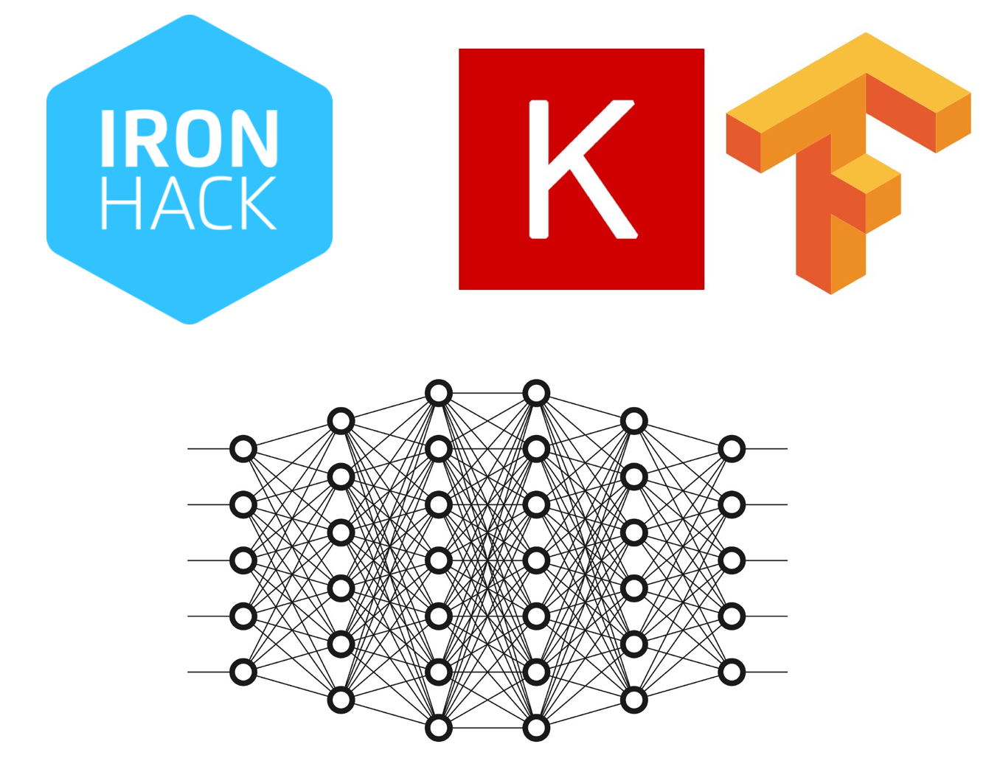

# Deep Learning Workshop 

This repository contains the materials (code and slides) for the Deep Learning Workshop taught at Ironhack.

# Contents
- [Installation](#Installation)
- [Materials](#Materials)        

# Installation
## Clone repository
If you want to make use of the materials, cloning the code to your local or downloading it would be the best. In order to do so:

    git clone git@github.com:pepebonet/DL_Workshop.git

## Install dependencies
We highly recommend to use a virtual environment to work with the code, as additional packages may need to be downloaded as you keep coding. To do so: 

`Create environment:`

    conda create --name dl_intro python=3.8
    conda activate dl_intro

From there the only packages that are needed are `tensorflow` and `keras` for now and that `jupyter notebooks` can be run. Remember the recommendation of using `Google Colab` instead of running it locally. 

# Materials

The lecture materials are divided into two main components. The slides that will support the presentation, and the coding materials for the topics covered. 

- [Slides for the lecture](presentation/DL_workshop.pdf)
- Jupyter notebooks for the different topics covered:
    - [Code for Neural Networks in Keras](scripts/IronHack_Workshop.ipynb)

